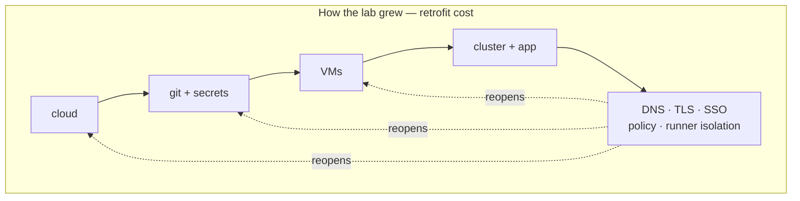
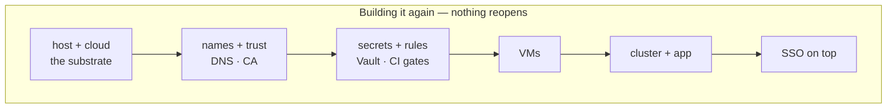
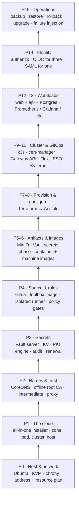

# Build Order

A ground-up build of a single-host infrastructure lab, designed for learning rather than speed.
Sixteen phases, eighty-one steps, each scoped to a single working session — ordered so nothing you
build later forces you to reopen what you built earlier.

**Intended setup:** a fresh Ubuntu 24.04 machine, with this repository present as a *reference* —
an existing, working implementation of the same architecture. You read it; you do not build inside
it. Everything you build goes in a new repository of your own.

---

## Before you start

### What the machine needs

| Requirement | Minimum | Why |
|---|---|---|
| OS | Ubuntu 24.04 LTS, x86_64 | The CloudStack installer and every package assumption below target it |
| CPU | 16 cores with VT-x/AMD-V **enabled** | CloudStack runs KVM guests; Packer builds an image with QEMU |
| RAM | **32 GB — treat as a hard ceiling** | Everything in this plan does not fit at once. Phase 0.5 is where you decide what runs when, and it is not optional |
| Disk | 200 GB+, SSD strongly preferred | Primary and secondary storage, VM disks, and image builds share it |
| Virtualization | `/dev/kvm` present | If this machine is itself a VM, **nested virtualization must be on** |
| Privileges | root / sudo | The cloud installer rewrites host networking |
| Network | Outbound internet | Packages, container images, ISOs, the installer itself |

Check the two that actually stop people before you begin:

```sh
egrep -c '(vmx|svm)' /proc/cpuinfo   # must be > 0
ls -l /dev/kvm                       # must exist
```

If either fails and this machine is a VM, fix nested virtualization on the hypervisor first. Nothing
in Phase 1 onward will work without it, and the failure surfaces much later as an opaque QEMU error.

### Two repositories, kept apart

This is the one piece of setup worth being strict about on a fresh machine.

```
~/reference/    # this repo, read-only. Never edit, never build here.
~/lab/          # yours, created empty in Phase 0.2. Everything you build lives here.
```

Clone or copy the reference somewhere you will not confuse with your own work, and consider making
it literally read-only (`chmod -R a-w`). The failure mode is real and easy: you open a reference
file to see how something works, change one line to test an idea, and three phases later you cannot
tell which decisions are yours. The entire value of this exercise is that distinction.

Your repository does not exist yet. Phase 0.2 creates it; Phase 4 stands up Gitea and pushes it
there. No credentials, images or state are inherited from the reference — that is the point.

### About the vendored CloudStack installer

The reference carries a copy of `get.cloudstack.cloud/install.sh` with an unattended mode
(`CLOUDSTACK_UNATTENDED=1`) added locally, so it can run headless from a script. Upstream's is an
interactive `dialog` TUI.

Use the vendored copy — Phase 1 assumes it. But know that the unattended path is a local patch, not
an upstream feature, because it matters twice: if you ever pull a fresh upstream copy the flag will
not exist, and the patch itself is a good example of what "vendoring" is *for*.

### How to read the citations

Where this document says *"the reference does X"* or names a file like `site.yml`, it is reporting
what a working implementation did and why — usually because that build hit a problem worth
inheriting the solution to. The lesson is always stated before the attribution, so a step still
makes sense if you read it without opening anything.

### This is a syllabus, not a runbook

It gives you the order, the reasoning behind every ordering constraint, what each step is for, and a
verifiable done-state. It does **not** give you the code. There is no Corefile in Phase 2.1, no
`openssl` invocation in 2.3, no policy manifest in 11.3. Working those out is the exercise; a step
you can paste is a step you have not learned.

Which matters more than it sounds, because **the reference does not contain about half of what this
plan builds.** That is the entire thesis — these are the things that were added last, or never — but
it changes how much help you get per phase:

| | Phases | What the reference gives you |
|---|---|---|
| **Well supported** | 1, 5–8, 12 | Working implementations of the cloud install, MinIO, Packer, Terraform, Ansible and the app. Read, understand, improve. |
| **Patterns only** | 0, 4, 10, 15 | No direct equivalent, but the shape is there — compose-stack layout, `ensure`-script idempotence, Flux Kustomization wiring, CI structure. |
| **Green field** | 2, 3, 9.3–9.4, 11, 13.3, 14 | DNS, the CA and PKI, TLS anywhere, cert-manager, Kyverno, Vault Kubernetes auth, alert receivers, authentik. None of it exists to copy. |

Budget accordingly. The green-field phases are not harder conceptually — they are harder because
nothing is there to check yourself against, which is also why they teach the most. If a phase is
going slowly, check which row it is in before concluding you have misunderstood something.

---

## First: the shape you are building toward

Here is what you will have at the end, in the shape the companion lab settled on. It has **two
stages**, and almost every design decision in this document follows from that split. You are not
copying this structure — you are building toward it, one verified step at a time — but knowing the
destination makes the ordering make sense.

**Stage 1 — a `bootstrap.sh` on the host.** Imperative, run once as root, orchestrating
self-contained all-in-one installers:

```
require_root → sync_clock (chrony) → install_docker → install_cli_tools
  → install_cloudstack            # cloudstack/cloudstack-install-all.sh — creates cloudbr0
  → bind_to_cloudbr0              # exports bind vars from cloudbr0_ip()
  → configure_docker_registry     # daemon.json insecure-registries, restarts Docker
  → write_ui_hosts                # /etc/hosts managed block
  → install_vault_server          # phase 'server': start, init/unseal, KV v2
  → install_gitea                 # server + PostgreSQL + admin token + infra repo + runner
  → install_minio                 # server + state/images buckets + scoped service accounts
  → install_vault_secrets         # phase 'secrets': service creds into KV + runner AppRole
  → install_proxy                 # nginx vhosts on :80
  → push_repo                     # ← fires full-deployment-ci
```

**Stage 2 — `full-deployment-ci` inside Gitea.** Declarative, triggered by that final push,
chained with `needs` so a failure skips the rest:

```
docker-ci  (app images)          → packer-ci (base template)
  → terraform-apply (infra)      → ansible-ci (provisioning)
                                     └─ site.yml: disk → wireguard → k3s → flux
                                                  → eso-bootstrap → todoweb → alloy
```

Four things in that shape are worth absorbing before you start:

1. **Vault installs in two phases.** The server comes up *early* because later installers read
   secrets from it; loading secrets happens *late* because it needs CloudStack, Gitea and MinIO
   already running. That split is the bootstrap paradox handled honestly rather than hidden.
2. **`write_ui_hosts` runs early, "so friendly names resolve for the installers below"** — the
   hostnames are needed by the *installers*, not just by your browser. Whatever replaces
   `/etc/hosts` has to exist that early too.
3. **The last thing bootstrap does is `git push`.** The host stage ends and the pipeline stage
   begins. Everything after that point is triggered by a commit.
4. **`site.yml` says "import order is load-bearing"** and gives a reason per play. That is the
   standard this document tries to meet for its own ordering.

---

## The one idea this is built on

The maturity roadmap reads like a list of things to add. It isn't. Nearly every item on it is
something that *should have existed before the thing it protects* — DNS before anything needed a
name, a certificate authority before anything served traffic, policy checks before there were
manifests to check, an isolated CI runner before that runner was trusted to deploy the lab.

Retrofitting them is expensive precisely because they are foundations. Adding TLS later means
revisiting every listener, every URL, every trust store. Adding DNS later means revisiting every IP
literal. Building in this order costs almost nothing extra, because you never build the thing that
has to be undone.

The one thing that sits *below* even those foundations is the cloud itself. The all-in-one
installer rewrites host networking, installs MySQL and NFS, enables root SSH and changes kernel
sysctls — so it runs on a nearly bare host, before there is anything on that host to disturb.





> **On who creates the bridge.** Phase 1's installer creates `cloudbr0` from the host NIC's current
> address, converting it to a static assignment. An earlier draft of this plan had Phase 0 create it
> instead, so that DNS could exist before the cloud — but the cloud moved to Phase 1, and that
> reason expired with it. Creating it yourself is still *possible*:
> `cloudstack-install.sh` checks whether the bridge exists and skips its own network configuration
> if it does, logging *"Bridge interface cloudbr0 already exists … skipping network configuration"*.
> The only thing it buys now is choosing the host's position in the `/24`, and in practice DHCP
> pools start well above the range the installer scans. Let the installer do it, and verify the
> result against your Phase 0.4 plan.

> **The reference lab already tried the CA.** `vault-install-all.sh` records that an early phase
> used to mint a self-signed root CA and that it was removed as dead code — *"nothing ever issued a
> leaf from it — no cert-manager, no TLS on the proxy or the k3s Gateway… If edge TLS ever gets
> built, that is where the CA belongs."* Phase 3.4 is that note, acted on. The removed script is in
> git history if you want a reference implementation.

---

## How to work through this

| Practice | Why |
|---|---|
| **One step, one session** | Start a fresh context per step. Give it the goal, the path to the reference lab, and the "Done when" line. Steps marked `L` are split candidates — split pre-emptively rather than discovering the limit halfway. |
| **Read the reference, don't clone it** | The existing lab answers *"how did this get wired up?"* — it is not to be copied wholesale. The exception is the vendored CloudStack installer: a tool you drive, not code you rewrite. |
| **Verify before moving on** | Every step has a **Done when** that is a command or an observable state, not a feeling. Infrastructure that has not been observed working is a hypothesis. |
| **Commit at every step boundary** | One step, one commit, reasoning in the message. You are building the habit of explaining *why* — the most valuable thing in the reference lab and the hardest to retrofit. |
| **Drills are not optional** | Each phase ends with a teardown-and-rebuild drill. The second build is where you find out what you understood and what you copied. |
| **Keep a decision log** | A running `docs/decisions.md`: what you chose, what you rejected, why. Six weeks in you will not remember why a rule is numbered 250. |

Effort marks: **S** an evening · **M** a weekend · **L** a project, with a suggested split point.

### The shape of the finished thing



---

## Phase 0 · The workbench

Nothing here is infrastructure yet. You are setting up the surface everything else is built on,
and deciding your address plan and resource budget before anything needs either.

### 0.1 Read the reference and draw the target · `M`

No code. Follow the two-stage shape above through the reference: `bootstrap.sh` top to bottom, then
`full-deployment-ci.yml` and the four workflows it chains, then `ansible/site.yml`. Then close it
and draw the finished system from memory — every component, which network it sits on, what talks to
what, and the part that matters most: **which things must exist before which other things.**

Drawing it from memory rather than while looking is deliberate. What you cannot reproduce is what
you have not understood yet, and the gaps are your reading list.

**Learning:** how to read an infrastructure codebase — find the entry point, follow the order of
operations, notice where state lives. Note especially how often a comment explains *why* an ordering
constraint exists rather than what the line does; that habit is the single most worthwhile thing to
take from the reference. Keep the drawing: you will correct it repeatedly, and the corrections are
the record of what you learned.

**Done when:** you can explain, without looking, what happens between running `bootstrap.sh` and a
browser reaching the app — including where the imperative host stage ends and the pipeline stage
begins.

### 0.2 Your repository, and its conventions · `S`

`git init` a new repository — **not** inside the reference clone. Directory layout, `.gitignore`,
`.editorconfig`, and the linters you will be held to: `shellcheck` and `shfmt`, `yamllint`,
`terraform fmt`. Wire them into a `Makefile` and a pre-commit hook.

Copy the reference's `.gitignore` early and read it. It is the list of things a working build
learned not to commit — unseal keys, service-account JSON, Terraform state, container data
directories — and inheriting it costs nothing while forgetting one entry can cost a lot.

**Learning:** formatting and linting are the cheapest form of policy, and setting them up first
means never reformatting the world later. Also your first encounter with **idempotence**: a hook
that behaves differently on the second run is a broken hook.

**Done when:** `make lint` passes on an empty repo and a deliberately malformed file fails it.

### 0.3 Host preparation, starting with the clock · `M`

Time synchronisation **first** — install chrony and confirm it is running — then verify `/dev/kvm`
and hardware virtualization, install Docker and the Compose plugin, and the CLI tools the installers
need (`jq`, `envsubst`, `openssl`). Write it as a script safe to run twice.

**Learning:** the reference lab's `sync_clock()` is the very first thing `bootstrap.sh` does, before
Docker and before anything else, because CloudStack expects chrony as its NTP daemon and because
TLS and apt are both time-sensitive. Clock drift is a cause of failures that look like anything
except a clock problem — and you will meet it again with certificates, JWTs and SAML assertions.
Second lesson: the distinction between **day-0 imperative setup** and everything after it, which is
declarative. Every IaC system has this seam.

**Done when:** `chronyc tracking` shows a synchronised source, `kvm-ok` reports usable
acceleration, and a second run of your script produces no changes.

### 0.4 The address plan · `M`

Decide and document every range the lab will use, before anything claims one. No configuration —
this step produces a table, and the table is what later phases are checked against.

You are not choosing the bridge subnet: `cloudbr0` inherits whatever network the host sits on, and
Phase 1's installer creates the bridge from the NIC's current address. What you are doing here is
writing down what that implies, and choosing the ranges you *do* control.

The plan has to reserve more than you might expect, because the installer derives the entire zone
from the bridge's `/24`: it scans for addresses that do not answer and claims roughly twenty
**public IPs** (about `.11–.30`) and twenty **pod IPs** (about `.31–.50`), then defaults the guest
CIDR to `172.16.1.0/24` with VLANs 100–200. Nobody types those ranges anywhere — they are derived,
which is precisely why they belong in a document.

The ranges you choose: the VPC and its three tier `/24`s, and two `/24`s for the WireGuard overlay
(hub-and-spoke needs two links). Check them against three things that allocate automatically —
k3s defaults to `10.42.0.0/16` for pods and `10.43.0.0/16` for services, and Docker hands itself
`172.17.0.0/16` through `172.31.0.0/16` as compose stacks are added.

**Learning:** CIDR planning, and why overlapping ranges are among the hardest bugs to unpick — a
collision with k3s's pod range presents as DNS failure, not as a routing problem. Also the habit of
documenting *derived* values: a range nothing configures is a range nobody remembers is taken.

**One source, many consumers:** the bridge address differs per host, so it is discovered at runtime
rather than written down — `cloudbr0_ip()` (`bootstrap.sh:43`) feeds every consumer from one
function: bind addresses, `GITEA_REGISTRY` and the Docker daemon's insecure-registry entry, the
hosts file, `VAULT_ADDR`, and `gitea_host` for `flux bootstrap`. Keep that discipline whatever you
decide about binding.

**Done when:** a committed table names every range, marks which are discovered, chosen, or derived,
and states which parts of the bridge `/24` belong to CloudStack.

### 0.5 The resource budget — 32 GB is the ceiling · `M`

Not a paperwork exercise. **Everything in this plan cannot run simultaneously in 32 GB**, so decide
now what runs when, or you will discover it as an out-of-memory event during Phase 14.

Here is the budget to start from. Adjust it as you measure real numbers, but do not skip building
it — the act of totalling this is the step.

| Layer | Component | RAM |
|---|---|---|
| Host | Ubuntu + KVM/QEMU overhead | ~2 GB |
| Cloud | CloudStack management server (JVM) | 2–4 GB |
| Cloud | MySQL | ~1 GB |
| Cloud | Secondary storage VM + console proxy | ~2 GB |
| Cloud | VPC virtual router | ~1 GB |
| Control plane | Gitea + PostgreSQL | ~0.7 GB |
| Control plane | MinIO, Vault, CoreDNS, proxy | ~0.6 GB |
| Control plane | CI runner, idle | ~0.2 GB |
| Guests | frontend + tunnel tiers | ~2 GB |
| Guests | backend tier (k3s server) | 8 GB |
| **Baseline total** | | **~20 GB** |
| Later | two k3s agents, at 3 GB each | +6 GB |
| Later | authentik (server, worker, postgres, redis) | +2 GB |
| Transient | a Packer build in flight | +3–4 GB |

Baseline leaves roughly 12 GB of headroom. Add the agents and authentik and you are at ~28 GB,
before page cache and before any CI job runs. A Packer build on top of that is what tips it over.

**Three rules that follow, and they shape later phases:**

1. **Size the k3s agents small — 2–3 GB, not like the backend.** Phase 9.2 adds them to make
   scheduling real, not to add capacity. Two 3 GB agents teach everything two 8 GB agents would.
2. **Never run an image build with the full estate up.** Phase 6 comes before the agents exist for
   exactly this reason. If you rebuild an image later, stop the agents first.
3. **authentik is the last thing on and the first thing off.** It is the largest optional consumer,
   and Phase 14 is the only phase that needs it running.

**Learning:** capacity planning, and the discipline of an explicit stop-order rather than hoping.
Note that disk is contended the same way: the reference's CI deletes its built images at the end of
every run *because "the disk is shared with CloudStack"*. On a single host, every resource is shared
with the hypervisor.

**Done when:** you have a budget table with your own numbers, a baseline total under 22 GB, and a
written stop-order naming what gets shut down first, second and third when you need headroom.

> **Drill 0** — reboot the host. Everything in Phase 0 should come back untouched.

---

## Phase 1 · The cloud

One file here is vendored — `cloudstack-install.sh`, downloaded from `get.cloudstack.cloud` and
carrying a local patch. Everything around it is yours to write. This phase is about understanding
what the installer does to your host, driving it deliberately, and verifying every layer it created.

### 1.1 Read the installer, and know which parts you own · `M`

Two different jobs, and confusing them is the mistake:

| File | What it is | What you do |
|---|---|---|
| `cloudstack-install.sh` | upstream, ~2,500 lines, plus a local unattended patch | **vendor** — read it, drive it, never maintain it |
| `cloudstack-install-all.sh` | ~60-line orchestrator | **write** |
| `prepare-kvm-host.sh` | root password + password SSH | **write** |
| `cloudmonkey-install.sh` | installs `cmk`, mints API credentials | **write** |
| `preflight-bridge-netfilter.sh` | fails fast if bridge netfilter is on | **write** |

So four scripts of your own, one inherited. Read all five, then write down every change they make to
your host that is *not* CloudStack itself.

**On the vendored file, two things worth knowing.** The unattended mode is a *local patch*, not an
upstream feature — roughly 260 semantic lines that shadow `dialog` with a shell function returning
success in silent mode, rather than removing ~100 call sites. Elegant, and re-appliable to a future
upstream. Which is the second thing: **do not reformat it.** Running it through `shfmt` reindents
every line and makes every future upstream diff unreadable. Exclude it from `make fmt`.

**`cloudmonkey-install.sh` mints the CloudStack API credentials** that Terraform needs in Phase 7 —
and Vault does not exist until Phase 3. Those credentials therefore live somewhere outside the repo
for two phases. Decide where before you run it; it is the lab's first real secret, alongside the
`ROOT_PASSWORD` the installer wants.

**Learning:** "all-in-one installer" means "this script owns your host for the next twenty minutes".
It will: set a **root password and enable root plus password SSH** (`prepare-kvm-host.sh`), because
CloudStack adds a KVM host over SSH *even when that host is itself*; install MySQL and NFS and
export `/export/primary` and `/export/secondary`; add the CloudStack repository and install
packages; and **disable bridge netfilter** via sysctl, which VPC port forwarding depends on.

Two of those you will act on directly: the SSH change is what Step 1.6 reverses, and the sysctl is
what Step 1.5 verifies. Note also what this code *is* — upstream, vendored, with a local unattended
patch. You read it and drive it; you do not maintain it. Reading an installer you are about to run
as root is the only moment you get to decide what it is allowed to do.

While reading `deploy_zone`, check the public and pod ranges it derives against what your Phase 0.4
plan asserts. Those numbers came from a reading of the reference; confirm them rather than inherit
them.

**Done when:** you have a written list of every host-level change, marked with which you intend to
keep, reverse, or verify by hand afterwards — and your network plan's derived rows are confirmed.

### 1.2 Write the wrappers · `M`

The vendored installer cannot be driven on its own: it needs a root password already set and SSH
already open before it can add the KVM host, and it needs sequencing around. Four scripts, all
yours:

| Script | Job |
|---|---|
| `prepare-kvm-host.sh` | set the root password, enable root + password SSH. **Runs first** — CloudStack adds the KVM host over SSH even when that host is itself. |
| `cloudmonkey-install.sh` | install `cmk`, mint the CloudStack API credentials |
| `preflight-bridge-netfilter.sh` | fail fast if `bridge-nf-call-iptables` is on |
| `cloudstack-install-all.sh` | orchestrate the three plus the installer, sharing one `ROOT_PASSWORD` |

**Learning:** the same helper conventions you built in Phase 0 — `log`/`warn`/`die`, `require_root`,
a `main` that reads as a table of contents — now applied to a script whose failure modes are other
people's. Note that the reference makes the netfilter check its own script rather than a line inside
the installer: that is what a problem hit hard enough to want checkable independently looks like.

**Two secrets appear here, and Vault does not exist until Phase 3.** `ROOT_PASSWORD` is chosen in
this step, and `cloudmonkey-install.sh` mints an API key and secret that Terraform will need in
Phase 7. Both live outside the repo for two phases. Decide where before you run anything — this is
the lab's first real credential handling, and "somewhere temporary" has a way of becoming permanent.

**Done when:** `cloudstack-install-all.sh` runs the sequence end to end on a host where CloudStack is
already installed, and is a no-op — proving the ordering and the guards before you rely on them.

### 1.3 Run it unattended, and watch the tracker · `M`

Run with `CLOUDSTACK_UNATTENDED=1` and a `ROOT_PASSWORD` you chose rather than the default. Watch
the tracker file fill in: `nfs_installed`, `mysql_configured`, `db_deployed`, `agent_configured`,
`zone_deployment`.

**Learning:** **idempotence by checkpoint**, in a real tool rather than in theory. The tracker is
how the installer knows what it already did, which makes it safe to re-run and resumable after a
failure — the same property your own `ensure` scripts will need.

**Done when:** the tracker shows `zone_deployment=yes` and the management UI answers on the bridge
address.

### 1.4 Read back what it built, layer by layer · `L` — split: networking, then storage + host

Account for every object in the UI and via `cmk`: zone, physical network and VLAN range, pod,
cluster, host, primary and secondary storage, the allocated public IP range, guest CIDR. Compare
each against your Phase 0 address plan.

**Learning:** the CloudStack object model — zone (a datacentre) → pod (a rack) → cluster
(like-for-like hypervisors) → host, with **primary storage** for running disks and **secondary
storage** for templates and snapshots. Reading it back rather than typing it in is the better
lesson: you are learning to audit infrastructure you did not create by hand.

**Done when:** you can name every object the installer created and point to where its address range
came from.

### 1.5 System VMs, a test guest, and a port forward · `M`

Wait for the secondary storage VM and console proxy. Launch a throwaway VM, give it a public IP and
a port forward, reach it from your workstation.

**Learning:** a cloud runs infrastructure of its own — the **virtual router** providing DHCP, DNS
and NAT per network is the one to understand, because it hands addresses to your tiers later and is
what you override when pointing them at your own resolver. The port forward is the check that
`bridge-nf-call-iptables=0` actually took; if forwarding silently fails while the VM is healthy,
that sysctl is the first place to look.

**Done when:** you reach a service on the test VM through its public IP, from your workstation.

### 1.6 Close the SSH hole you opened · `S`

Remove `/etc/ssh/sshd_config.d/01-cloudstack.conf`, restart sshd, confirm the cloud keeps working —
including creating and destroying a VM.

**Learning:** the difference between a credential needed *during* an operation and one left enabled
forever. `prepare-kvm-host.sh` documents this revert in its own header —
*"LAB USE ONLY. Root + password SSH is insecure; revert after the host is added"* — and nothing in
the reference lab ever performs it. That is exactly how temporary lab conveniences become permanent
exposure.

**Done when:** `sshd -T` shows password and root login disabled, and you can still create and
destroy a VM.

> **Drill 1** — remove the `zone_deployment` key from the tracker and re-run the installer. Watch it
> skip everything already done and redo only the zone.

---

## Phase 2 · Names and trust

The two foundations the original lab added last. Everything from here can be referred to by name
and reached over TLS from the moment it exists.

Note the timing constraint the reference lab reveals: `write_ui_hosts` runs *before* the service
installers, "so friendly names resolve for the installers below". Your resolver has to be up that
early too — it is not just for browsers.

### 2.1 CoreDNS on the bridge · `M`

A CoreDNS container bound explicitly to the bridge address on port 53, authoritative for
`lab.test`, forwarding everything else upstream. Static records first.

**Learning:** the difference between an **authoritative** server and a **recursive resolver**.
Zones, A records, TTLs. And the practical trap: Ubuntu already runs systemd-resolved on port 53, so
binding `0.0.0.0:53` collides — bind to the bridge address.

**Done when:** `dig @<bridge-ip> cloudstack.lab.test +short` returns your bridge address, and
`dig @<bridge-ip> example.com` still resolves.

### 2.2 Point the host and your workstation at it · `S`

A systemd-resolved drop-in on the host; a resolver change or hosts-file fallback on your
workstation.

**Learning:** resolver precedence — the deep stack of `/etc/hosts`, nsswitch, systemd-resolved's
stub, and the actual upstream. Most "DNS is broken" incidents are "something earlier answered
first".

**Done when:** plain `ping cloudstack.lab.test` resolves on the host with no hosts-file entry.

### 2.3 Generate an offline root CA · `M`

A root key and self-signed root certificate with a long lifetime, then encrypted and put somewhere
not casually usable. It signs exactly one thing: an intermediate.

**Learning:** **chain of trust** — why a root that signs leaf certificates directly is a root you
can never protect. What is inside a certificate: subject, SANs, key usage, validity — and why modern
clients ignore Common Name and require **Subject Alternative Names**. Why certificates for IP
addresses are painful, which is the deeper reason DNS came first.

**Done when:** `openssl x509 -text` on your root shows CA:TRUE, and the root key is not sitting
unencrypted beside it.

### 2.4 Issue an intermediate and a first leaf certificate · `M`

The intermediate signs a leaf for a test hostname. Serve a static page from nginx over HTTPS with
the chain assembled correctly.

**Learning:** the CSR flow — key stays put, request travels, certificate comes back. How to assemble
a chain, and why a server that omits the intermediate works in your browser (which cached it) and
fails in `curl`.

**Done when:** `curl --cacert root.pem https://test.lab.test` succeeds with no `-k`.

### 2.5 The reverse proxy, and where TLS terminates · `M`

Promote that nginx into a real component: one proxy, Host-header routing, holding certificates for
every host-tier name. Put CloudStack behind it as the first real backend. Decide explicitly whether
the hop from proxy to backend is plain HTTP or re-encrypted, and write the decision down.

**Learning:** **TLS termination** as an architectural choice. Terminating once means one place to
renew certificates and configure ciphers; it also means the hop behind it is unencrypted, which is
fine on a loopback bridge and not fine across a network.

**A war story worth reading first:** the reference lab's `bind_to_cloudbr0()` sets Gitea's
`ROOT_URL` to the *direct* service URL on `:3000`, not through the proxy, with the comment *"Gitea
serves plain HTTP here (TLS was reverted), so this MUST be http — an https ROOT_URL marks the
cookies Secure and the HTTP login silently loops."* That is what a half-finished TLS migration
feels like: not an error, a login page that quietly refuses to stay logged in. Doing TLS before the
services exist is how you avoid it.

**Done when:** `https://cloudstack.lab.test` serves the management UI with a valid chain and working
login.

### 2.6 Distribute trust · `S`

Install the root into the host's system trust store and your workstation's. Write down the
procedure — you will repeat it for containers, VMs, a JVM, and a Kubernetes pod.

**Learning:** there is no such thing as "the" trust store. The OS has one, browsers may have their
own, Java has `cacerts`, containers each have a copy. Issuing a certificate is minutes of work;
distributing trust is the actual project.

**Done when:** a browser shows a valid padlock with no warning, and `curl` on the host needs no
`--cacert`.

> **Drill 2** — delete the DNS and proxy containers and their volumes; rebuild from the repo alone.
> Then issue a certificate with the wrong SAN and read the exact error your browser and `curl` each
> give you.

---

## Phase 3 · Secrets — the server phase

Vault arrives early because everything after it wants to store or fetch a credential. But only the
*server* goes up now: seeding credentials for Gitea and MinIO has to wait until those exist, which
is Phase 5.4. The reference lab makes this split explicit —
`vault-install-all.sh [server|secrets|all]` — and `bootstrap.sh` calls the two phases on either side
of the service installers.

### 3.1 Vault, behind TLS, from the first start · `M`

Vault in a container using a certificate from Phase 2, at `vault.lab.test`. Initialise it, capture
the unseal keys and root token deliberately rather than incidentally.

**Learning:** **seal and unseal** — Vault's storage is encrypted with a key it does not keep, so a
restarted Vault is useless until unsealed. And the **bootstrap paradox** in its purest form: the
thing that will hold every secret has to come up before there is anywhere safe to put its own
credentials. The two-phase install is that paradox managed rather than denied.

**On Shamir, be honest about what you are actually doing.** The reference initialises with
`-key-shares=1 -key-threshold=1` and writes the single key next to the root token in a gitignored
directory. That is the *degenerate* case of secret sharing — one share, held in one place, by the
same person who holds the root token. It is a reasonable lab choice, but understand it as "the
unseal key is a file on this host", not as "Vault is protected by threshold cryptography". Splitting
shares only means something when the holders are different people.

**One concrete gotcha:** Vault 2.x will not chown bind-mounted storage, so a root-owned data
directory fails `operator init` with a permission error that does not say "ownership". MinIO has the
same class of problem with a different UID. Bind-mount ownership is worth checking first whenever a
containerised stateful service refuses to initialise.

**Decide the address now, and make it a name.** Vault is the one service whose address propagates
furthest: the reference computes `VAULT_ADDR=http://<bridge-ip>:8200` and publishes it as a Gitea
Actions variable *and* into a `cluster-vars` ConfigMap that Flux substitutes into the
ClusterSecretStore. That means every CI job's AppRole login and every secret ESO fetches crosses the
lab network **by IP, in the clear**. It is the most consequential plaintext hop in the whole
reference lab, and it is invisible because no manifest contains it. Use `https://vault.lab.test`
from the start and it never exists.

**Done when:** `vault status` over HTTPS reports sealed=false, every client reaches it by name, and
you can articulate where the unseal material lives and who could reach it.

### 3.2 KV v2, paths, and your first policies · `M`

Mount KV v2, write a secret, read it back with a token that is *not* root and can only read that
path.

**Learning:** Vault's path-based model, and why KV v2's `data/` prefix trips everyone up in policy
paths. **Least privilege** made concrete. If you only ever use the root token, you have installed a
very expensive text file.

**Done when:** a scoped token reads its own path and is denied on a neighbouring one.

### 3.3 Turn on the audit device · `S`

A file audit device, before anything interesting is stored.

**Learning:** audit-before-use is a discipline: a secret store without an audit trail cannot answer
the only question that matters after an incident — *what was read, by whom, when*. Vault stops
serving requests if it cannot write its audit log; that is deliberate.

**Done when:** you can find your own secret read in the audit log, and see the value is hashed
rather than recorded.

### 3.4 Move the intermediate CA into Vault's PKI engine · `L` — split: engine + intermediate, then roles + issuance

Enable the PKI secrets engine, have it generate a CSR, sign that with your offline root, import the
signed intermediate back. Define a role and issue a certificate through Vault.

**Learning:** why a CA as a *service* beats a CA as a *script* — roles constrain what may be issued,
TTLs can be short because renewal is automatic, and every issuance is audited. This is the step the
reference lab's own comment points at: it built a Vault CA, found nothing consumed it, and removed
it with a note saying this is where it belongs once edge TLS exists. You are building the consumer
first, so it survives.

**Done when:** `vault write pki/issue/...` returns a usable certificate whose chain validates
against your offline root.

### 3.5 Automate renewal, then prove it · `M`

A systemd timer that renews the proxy's certificates from Vault well before expiry and reloads
nginx. Set a deliberately short TTL and watch a renewal happen while you are looking at it.

**Learning:** short-lived certificates are only safe when renewal is boring and automatic. Issuing
is not enough: the server has to be told to *reload*, and forgetting that is why "the certificate
renewed but the site serves the old one" is such a common incident.

**Done when:** a certificate with a short TTL renews without your involvement and the served
certificate changes.

### 3.6 The idempotent seeding pattern, and CloudStack's keys · `M`

Write the first `ensure`-style script: generates or captures a credential if absent, leaves it alone
if present, never rotates silently. Use it to store the CloudStack API key and secret — the one
service that already exists.

**Learning:** idempotence as a contract, and the **rotation trap**: some consumers read a credential
once at initialisation and never again, so quietly regenerating it desynchronises two systems in a
way that surfaces much later. The reference lab's `vault-ensure-postgres.sh` documents this at
length and chooses non-rotation deliberately; the skill is deciding per-secret and writing down why.

**Done when:** running the script twice logs "already present" the second time, and `cmk`
authenticates using the key read back out of Vault.

> **Drill 3** — delete the Vault container keeping its data volume; bring it back and unseal from
> your stored shares. Then do it again *without* the volume and observe exactly how much you lose.

---

## Phase 4 · Source of truth and the rules

Git becomes infrastructure the moment anything deploys from it. The runner is isolated from day one,
and the policy gates exist before there is anything to gate.

### 4.1 Gitea over TLS at a real name · `M`

Gitea plus its database, behind the proxy at `gitea.lab.test`. Admin credentials seeded from Vault,
not typed into a form.

**Learning:** why the SCM is a tier-0 system — once deployments pull from it, its availability is
your deployment availability. Also `ROOT_URL`-style settings: get them wrong and you get broken
redirects and mysterious cookie failures. Read 2.5's war story again before you set yours.

**Two directions, pick deliberately per credential.** A secret can be *generated in Vault and handed
to the service at install time*, or *created by the service and captured into Vault afterwards*. The
first is cleaner and is right for an admin password — the reference gets this one wrong, taking its
admin password from a committed `.env` default. The second is unavoidable for anything the service
mints itself: Gitea API tokens **cannot be read back after creation**, so the reference mints a
fresh one named `bootstrap-<epoch>` on every run and captures it. That is correct, and it also
means tokens accumulate — decide now whether you prune them.

**Scope the token to the job.** That minted token is created with `--scopes all` and then used by CI
to log into the container registry — the pipeline's own comment flags it as "an all-scopes admin
PAT". A registry push needs package write, not administrative control of your source of truth. Mint
a scoped token for CI and keep the admin token for administration.

**Done when:** you can clone over HTTPS with no certificate flags, and the admin password came from
Vault.

### 4.2 Push the repo, protect the branch · `S`

Push what you have. Turn on branch protection with required status checks before the checks exist,
so you feel the gate close.

**Learning:** trunk-based development, and why protection rules are infrastructure rather than
process decoration. Note that the reference lab has **no PR-triggered CI at all** — every workflow
is `workflow_dispatch` plus `workflow_call`, with only `full-deployment-ci` firing on push to
`main`. You are building a gate it does not have.

**One operational gotcha worth internalising now:** the reference pushes *committed history only*,
force-pushing HEAD onto `main`. Uncommitted work is not deployed — which sounds obvious until you
spend twenty minutes debugging why a fix you are looking at in your editor had no effect. It
authenticates with a token in an HTTP header rather than in the remote URL, so no credential ends up
in git config; copy that.

**Done when:** a direct push to `main` is refused.

### 4.3 The toolbox image · `M`

Build a CI image with every tool a pipeline needs, pinned by version: terraform, packer, ansible,
kubectl, helm, `cmk`, `mc`, trivy, and the Docker CLI.

**Learning:** why pipelines should not `apt-get install` at runtime — reproducibility, speed, and
supply-chain surface. The reference lab's `runner/Dockerfile` is worth reading closely: it is
arch-aware, pins every version, and each tool carries a comment saying which pipeline needs it. That
last habit is what stops a toolbox image accumulating things nobody can justify.

**Done when:** a job runs `terraform version` and `trivy --version` from the image with no runtime
downloads.

### 4.4 An isolated CI runner · `L` — split: working runner, then take its privileges away

Register a runner that does **not** mount the host Docker socket. Use a dedicated DinD service or
one-shot ephemeral runners.

**Learning:** the most important threat model in this plan. Mounting `/var/run/docker.sock` into a
container grants it the ability to start any container, including a privileged one mounting the host
filesystem — root on the host, handed to anyone who can open a pull request. It matters more here
than in the reference lab, because this host is also your hypervisor. Ephemeral runners matter for a
second reason: a persistent runner carries the previous job's secrets and caches into the next.

**One real constraint to design around:** `packer-ci` needs `/dev/kvm` inside the job container.
Whatever isolation you choose has to still pass a device through, which is a genuinely harder
problem than it looks — solve it now rather than discovering it in Phase 6.

**Done when:** a job runs successfully, `docker ps` inside it cannot see the host's containers, and
a job can still open `/dev/kvm`.

### 4.5 The first pipeline: lint and format gates · `M`

A workflow running shellcheck, shfmt, yamllint and `terraform fmt -check` on every pull request,
wired into the required checks from 4.2.

**Learning:** shift-left in its cheapest form, plus the practical mechanics of CI — what a runner
does, why jobs need pinned images, and how to keep pipelines fast enough that you don't skip them.

**Done when:** a PR with a formatting error is blocked from merging.

### 4.6 Security scanning, and a gate that means something · `M`

Add a secret scanner and `trivy`, and place the scan **before** the push so a failing image never
reaches the registry. Add `tflint` and `checkov` ready for the Terraform to come.

**Learning:** **policy as code** — the difference between a convention you follow and a rule the
system enforces. Also the discipline of an ignore-file: the reference lab's `.trivyignore` requires
a reason per CVE and notes that `--ignore-unfixed` already drops unpatched CVEs, so nothing belongs
there merely because upstream has not fixed it. An ignore file without that rule becomes a place
where problems go to be forgotten.

**Done when:** a commit containing a fake cloud credential is rejected, and an image with a fixable
HIGH CVE fails before it is pushed.

> **Drill 4** — open a PR that hardcodes a password, misformats a shell script, and adds an unpinned
> image tag. Confirm each is caught; fix them one at a time and watch the gates open.

---

## Phase 5 · Artifacts, state, and closing the secrets loop

### 5.1 MinIO with TLS and scoped service accounts · `M`

MinIO at `minio.lab.test`, root credential generated into Vault, plus separate scoped service
accounts for Terraform state and image uploads. Enable versioning on both buckets.

**Learning:** the S3 API as a de-facto standard, and the difference between a root credential and a
scoped one. Two accounts is not bureaucracy — a compromised image-upload key cannot read your
infrastructure state, which contains every value your infrastructure knows.

Two practices from the reference worth copying exactly. The **root keys never leave the host** —
only the scoped service-account keys are written out for Vault to load, so the most powerful
credential has the smallest blast radius. And the IAM policy is a **committed template** with the
bucket name substituted per account, rather than JSON inlined in a script: a policy you can read in
a diff is a policy someone can review.

**Done when:** the images account is denied when it tries to list the state bucket, and the policy
that produced that denial is a file in your repository.

### 5.2 Remote state, proven with a trivial config · `M`

Wire the S3 backend and apply a config that creates nothing but a random value. Not the cloud yet —
learn the state model before it has anything real in it.

**Learning:** what Terraform state *is*, and why it is sensitive. Why locking exists. One practical
detail from the reference: a backend block cannot interpolate, so the endpoint and credentials
arrive as `AWS_*` environment variables rather than `-backend-config` — which is why they come out
of Vault as env vars in the pipeline.

**Done when:** the state object exists in MinIO and a second concurrent apply is blocked by the
lock.

### 5.3 Break state, recover state · `S`

Delete your local `.terraform` directory and re-initialise from the backend. Practise
`terraform state list` and inspecting a single resource.

**Learning:** the backend, not your machine, is the source of truth — plus enough state-command
fluency that a future drift or import problem isn't frightening.

**Done when:** a fresh `terraform init` on a cleaned checkout produces an empty plan.

### 5.4 Close the loop: the Vault secrets phase · `M`

Now that CloudStack, Gitea and MinIO all exist, seed their credentials into Vault with your `ensure`
scripts, and create the CI role and credential the pipeline will authenticate with.

**Learning:** this is the second half of the split from Phase 3, and the reason it exists: a secret
store cannot hold credentials for services that do not yet exist. Sequencing this correctly is what
lets every pipeline afterwards read *everything* from one place. Note what the reference lab
achieves by doing this — `docker-ci` reads the registry address from Vault rather than deriving it,
with the comment *"Never hardcode the address — it is host-specific."*

**Done when:** a scripted run seeds every service credential, is safe to repeat, and a test job can
authenticate to Vault and read one of them.

> **Drill 5** — restore a previous version of the state object from MinIO's versioning and confirm
> Terraform reads it.

---

## Phase 6 · Images — containers, then machines

Two kinds of image, built by two different tools, both landing in registries the rest of the lab
pulls from. This is the first piece of genuine automation, and where "immutable infrastructure"
stops being a slogan.

### 6.1 Build, scan and push the application container images · `M`

Build the API and web images, scan them, and push each twice — once tagged with the short commit
SHA and once as `latest` — to the Gitea container registry. Put the scan **before** the push.

**Learning:** container images are the other half of immutability, and the ordering inside the job
is the lesson: build → scan → push means a failing scan leaves nothing in the registry to
accidentally deploy. The double tag has a division of labour worth adopting — the reference's
comment calls the SHA *"what a Deployment should pin"*, with `latest` for humans.

Two details from the reference worth copying: it verifies the tags by **asking the registry what it
holds** rather than trusting the push's exit code (*"a 404 is what a wrong owner or a silently-refused
login looks like"*), and it deletes the local images afterwards with `if: always()`, because the
runner's disk is shared with CloudStack and failed runs are what accumulate.

**Done when:** both images exist in the registry at a SHA tag you can query, and an image with a
fixable HIGH CVE fails the job before anything is pushed.

### 6.2 A Packer build · `L` — split: any image first, then the customisation

Build an Ubuntu image with cloud-init, your CA already in its trust store, your resolver already
configured, baseline hardening, and — **importantly — a root filesystem that grows to fill its
disk**.

**Learning:** **immutable infrastructure** — you replace machines rather than patching them. Baking
the CA and resolver in is a direct payoff from building Phase 2 first.

The disk detail is not a footnote, and it is worth tracing to its actual cause. The reference builds
a **20 GB disk**, but its autoinstall config asks for `storage.layout.name: lvm` — subiquity's
default LVM layout, which sizes the root logical volume at roughly 10 GB and leaves the rest of the
volume group **unallocated**. Nothing grows into it, and k3s fills what's there. The reference
compensates with `disk.yml` at provisioning time, walking partition → PV → LV → filesystem, and its
comment notes the `lvextend` also has to claim "subiquity's unallocated extents".

Fix it where it originates — in the autoinstall storage layout, so the image is born correct —
rather than growing it on every boot. That deletes a playbook from your Phase 8 instead of
inheriting one.

One more detail worth copying: the reference pins cloud-init's datasource list to
`[ConfigDrive, None]` rather than leaving CloudStack's own datasource in play. Being explicit about
where a machine gets its identity avoids a whole class of first-boot mystery.

**Done when:** the build produces an image artifact, repeats from a clean checkout, and a VM booted
from it shows a root filesystem matching its disk size.

### 6.3 Scan, sign, and register as a template · `M`

Scan the image, sign it with cosign, upload to the MinIO images bucket, register it as a CloudStack
template through the API.

**Learning:** **supply chain security** — provenance answers "where did this come from and has it
changed". Signing is only half of it; a signature nobody verifies is decoration.

**And a trade you should make consciously.** CloudStack's secondary storage VM *pulls* the template
from a URL you hand it, with no credentials — so the reference's images bucket is configured for
**anonymous read**. Your VM images are world-readable to anything on the lab network. That is the
price of the pull-based registration flow, and the options are to accept it deliberately, to put the
bucket behind something that authenticates the SSVM, or to make the images uninteresting to read.
What you should not do is discover it later.

**Done when:** the template shows Ready in CloudStack and `cosign verify` succeeds against your key.

### 6.4 Move both builds into CI · `M`

Both image builds run in the pipeline on the isolated runner and publish automatically.

**Learning:** why builds belong in CI even for one person. This is also where the `/dev/kvm`
constraint from 4.4 gets paid: a nested-virtualization build inside a job container is the hardest
thing your CI does, and `PACKER_LOG=1` with a grep for qemu/kvm lines on failure — as the reference
does — is the difference between a debuggable failure and "Qemu failed to start".

**Done when:** a pipeline run produces both the pushed container images and a registered, signed
template, with no local commands.

> **Drill 6** — rebuild the image from scratch and compare it to the previous one. Differences you
> can't explain are undeclared inputs.

---

## Phase 7 · Infrastructure as code

The cloud and its zone were built by an installer; from here everything inside that zone is declared
in code.

### 7.1 Provider, offerings, VPC, one tier · `M`

Wire the CloudStack provider with API credentials from Vault. Ensure the VPC and network offerings
exist, then create the VPC and a single tier network. Read the plan output carefully before
applying.

**Learning:** providers, resources, and the **plan/apply cycle**. You also meet the boundary between
what the installer owns (zone, pod, cluster, host) and what code owns (everything inside the zone).
Offerings sit awkwardly across that line, which is why the reference ensures them with a script
invoked from Terraform rather than as a resource — a good example of an honest workaround.

**Done when:** the VPC and one tier exist and a re-plan shows no changes.

### 7.2 All three tiers with deny-by-default ACLs · `L` — split: networks, then rule sets

Frontend, tunnel and backend, each with its own ACL: deny everything, then allow only what is
needed, with a comment on every rule explaining why.

**Learning:** network segmentation as a design tool. The crucial mechanical detail: **these ACLs are
stateless**, so allowing outbound traffic does not automatically allow the reply — you need an
explicit rule for return traffic on ephemeral ports. That single fact explains most of the rule
numbering in the reference lab.

**Concurrency, in two places:** CloudStack loses ACL rules silently when they are created
concurrently. The reference guards this twice — `parallelism = 1` on the
`cloudstack_network_acl_rule` resource, *and* `terraform apply -parallelism=1` on the whole run in
CI, because "the whole apply is serialised rather than just that resource". When a provider has a
known race, belt and braces is the right instinct.

**Done when:** a VM in the frontend tier cannot reach one in the backend tier, and both reach the
internet.

### 7.3 VMs, public IPs, and NAT · `M`

One VM per tier from your Packer template, a public IP each, port forwards for SSH plus 80 and 443
where they belong.

**Learning:** NAT and port forwarding, and the distinction between a private address inside the VPC
and a public one that is a translation. If a forward is configured but nothing arrives, check
`net.bridge.bridge-nf-call-iptables` first — you verified it in Phase 1.5 for exactly this reason.

**And the lesson that catches everyone:** `terraform apply` returns once CloudStack marks each VM
*Running*, which is **before the guest has finished booting and before the virtual router has
programmed the port forward**. A cloud API returning success does not mean the thing is usable. The
reference handles this in the next phase with `wait_for_connection`; know now that you will need it.

**Done when:** you SSH into each VM using its public IP and the key from Vault.

### 7.4 Outputs, inventory, and DNS records · `M`

Emit outputs, generate the Ansible inventory from them, and write the dynamic half of your DNS zone
from those same outputs.

**Learning:** closing the loop between provisioning and naming. In the reference lab this is a manual
README step after the pipeline runs; here it is automatic, because DNS existed before the
infrastructure did. The clearest single payoff of the reordering.

**What names replace.** The reference keeps host-specific addresses out of git by funnelling three
of them through a `cluster-vars` ConfigMap that Flux's `postBuild` substitutes into manifests —
`VAULT_ADDR`, `VAULT_ROLE_ID` and `REGISTRY`. That is a genuinely good pattern for values that
*must* vary per host, and its comment says exactly why it exists: *"so no git manifest hardcodes an
address."* Names make two of those three unnecessary. Keep the ConfigMap for what actually is
host-specific; stop using it to paper over addresses that could have been names.

**Done when:** `dig grafana.lab.test` returns the backend public IP without you editing anything by
hand, and no substituted variable in your manifests carries an IP address.

### 7.5 Terraform in CI, with drift detection · `M`

Plan on every pull request, apply on merge, and a scheduled plan that fails loudly if non-empty.

**Learning:** **drift** — the gap that opens when someone changes something by hand. Note two limits.
The reference lab's `terraform-apply` is `-auto-approve` with no plan stage and no schedule, so it
has no drift detection at all — you are adding it. And whatever you add still will not cover the
zone, pod, cluster and host, which live outside Terraform's state entirely.

**Done when:** a manual change in the CloudStack UI to a Terraform-managed object causes the
scheduled plan to fail.

> **Drill 7** — the big one. `terraform destroy` the entire VPC and rebuild from nothing. Time it.
> Worth repeating after every later phase.

---

## Phase 8 · Configuration management

Terraform created machines; Ansible makes them into specific machines. The reference lab's
`site.yml` opens with *"Import order is load-bearing"* and justifies every position — hold yourself
to the same standard.

### 8.1 Dynamic inventory, and refusing to succeed silently · `M`

Read the inventory from Terraform state rather than maintaining a static file. Then add two guards
before anything else runs: fail loudly if the state contains no host records, and wait for SSH
rather than assuming it.

**Learning:** Ansible's **push model** — SSH, no agent, in contrast to the pull model Flux uses
later. But the real lesson is the guards. The reference lab's comment says it exactly: *"An empty
state still exits 0 here and matches no hosts later, so every step below would pass having done
nothing. Fail loudly instead."* A pipeline that succeeds while doing nothing is worse than one that
fails, because you will believe it.

**Done when:** an ad-hoc ping succeeds against all three hosts, and the job fails immediately if run
against empty state.

### 8.2 Base role: resolver, trust, hardening, time · `M`

Point each VM at your DNS, confirm the CA is trusted, apply baseline hardening and time
synchronisation. Add a preflight that proves each tier has the egress it needs.

**Learning:** **idempotence** as Ansible's core promise — a task describes desired state, so a second
run reports zero changes. And the value of preflights: the reference explicitly curls `get.k3s.io`
from the backend before installing k3s, so a broken source-NAT fails as "no egress" rather than as a
confusing installer error twenty steps later.

**Done when:** a second playbook run reports `changed=0` on every host, and the egress preflight
passes.

### 8.3 The WireGuard overlay · `L` — split: one link, then the second and routing

A hub-and-spoke mesh with the tunnel host in the middle: frontend to tunnel, tunnel to backend, no
direct path between the outer two.

**Learning:** **overlay networks**, and a design detail worth copying exactly — the reference
generates keys on-host and never moves them: *"only public keys are exchanged between peers, so
there is no secret store to manage."* An architecture that removes a secret entirely beats one that
protects it well. This is also the honest answer to "should I use mTLS between hosts": the overlay
already authenticates peers cryptographically.

**And the classic trap: MTU.** Encapsulation shrinks the usable packet size, so at 1500 you get a
network where `ping` works perfectly and TLS handshakes or git clones hang forever.

**Done when:** frontend reaches backend through the tunnel host, cannot reach it any other way, and
a large file transfers without stalling.

### 8.4 Ansible in CI · `S`

The playbook runs from the pipeline after a successful Terraform apply.

**Learning:** sequencing two tools with different models, and where the seam belongs — Terraform
owns existence, Ansible owns contents. Putting a decision on the wrong side of that line is a common
design mistake.

**Done when:** a full pipeline run provisions and configures all three tiers unattended.

### 8.5 Compose the deployment chain · `M`

You now have four independent pipelines — container images, machine image, infrastructure,
provisioning. Compose them into one workflow that runs them in dependency order and stops at the
first failure.

**Learning:** pipeline composition, and why the top-level workflow should **own no steps of its
own**. The reference's `full-deployment-ci` is twenty lines: four jobs, each delegating to the
workflow that owns that stage, chained with `needs`. That keeps every stage independently runnable
for debugging while still giving you one button for a cold build.

Two things to get right. **Secret propagation:** a called workflow does not inherit credentials
automatically — the reference annotates `secrets: inherit` with the consequence of forgetting it
(*"without it each called workflow authenticates to Vault with an empty secretId"*). And **trigger
loops:** anything your automation commits back to the repo can re-fire the chain, which is why the
reference excludes the cluster directory from its push trigger.

**Done when:** one dispatch builds images, provisions infrastructure and configures every tier in
order, and a failure in an early stage visibly skips the rest.

> **Drill 8** — destroy one VM, let Terraform recreate it, re-run Ansible; everything should
> converge unattended. Then break WireGuard on purpose and diagnose with `wg show`.

---

## Phase 9 · Kubernetes

Multi-node early, because a single-node cluster hides exactly the behaviours worth learning.

### 9.1 k3s server and your first workload · `M`

Install the server on the backend tier, retrieve the kubeconfig, run a single pod. Pin the version.

**Learning:** what a Kubernetes control plane is made of — API server, scheduler, controller
manager, etcd — and what k3s bundles or replaces. On pinning: the reference deliberately leaves k3s
unpinned, reasoning that *"the lab wants whatever is current at build time, and a pin here would go
stale silently rather than fail loudly."* That is a defensible trade for a lab that is rebuilt
often, and the wrong one for a lab you intend to *operate* — you cannot practise upgrades on
something that silently upgrades itself.

**Done when:** `kubectl get nodes` works and a test pod reaches Running, at a version you chose.

### 9.2 Add two agent nodes · `M`

Two more VMs joining as agents — **sized 2–3 GB each, deliberately smaller than the backend.**
Create a dedicated small service offering rather than reusing the backend's 4 vCPU / 8 GB one.

**Learning:** the join process and the node token. More importantly, scheduling becomes real —
anti-affinity and topology spread stop being abstract. A single-node cluster silently satisfies
constraints a real one would not.

**On the sizing, which is a budget decision not a shortcut:** these agents exist to make placement
observable, not to add capacity, and two 3 GB nodes demonstrate every scheduling concept two 8 GB
nodes would. At 8 GB each they would put you 6 GB over your 32 GB ceiling before authentik exists.
Small nodes also teach something larger ones hide — you will actually hit resource pressure and see
how the scheduler responds, which is the behaviour you came for.

**Done when:** three nodes are Ready, a three-replica Deployment lands on more than one, and your
running total still matches the Phase 0.5 budget.

### 9.3 Registry trust, in every place it is needed · `S`

Make the cluster able to pull your images. Then write down every place registry trust had to be
configured.

**Learning:** this is the CA lesson from 2.6 in a different costume. The reference lab's `docker-ci`
opens with a warning that registry trust *"has to exist in three places or this fails in ways that
look like workflow bugs"* — the Docker CLI in the toolbox image, `insecure-registries` in the runner
host's `daemon.json`, and `/etc/rancher/k3s/registries.yaml` for containerd. With TLS you replace
three insecure-registry entries with three trust-store entries; the count does not change, but the
failure mode gets much better.

**Done when:** a pod pulls an image from your registry by name over TLS, with no insecure-registry
entry anywhere.

### 9.4 cert-manager, issuing from Vault · `M`

Install cert-manager and configure a Vault issuer pointing at the PKI engine from Phase 3, so the
cluster mints certificates from the same chain as everything else.

**Learning:** the in-cluster equivalent of the renewal timer from 3.5 — a controller watching
Certificate resources and keeping Secrets full of valid material. The general shape of Kubernetes:
declare what you want, a controller reconciles it.

**Done when:** a Certificate resource produces a Secret whose chain validates against your offline
root.

### 9.5 Gateway API, HTTPS listener, and cluster DNS · `M`

Install NGINX Gateway Fabric with HTTP and HTTPS listeners backed by the cert-manager Secret, route
a test workload through it, and add a CoreDNS forward stanza so pods resolve `lab.test`.

**Learning:** why Gateway API improves on Ingress by splitting responsibilities — infrastructure
owns the Gateway, application teams own Routes. Hostname-based routing, and why a route without a
hostname becomes a catch-all that steals traffic from neighbours. And that Kubernetes has its own
DNS for service discovery, so reaching names outside the cluster is deliberate configuration — the
exact gap that blocks OIDC later.

**Done when:** the test app answers over HTTPS at a real name, and a pod resolves `vault.lab.test`
and curls it with a valid certificate.

> **Drill 9** — cordon and drain a node while the test app runs; watch pods reschedule. Uncordon and
> observe nothing returns automatically: Kubernetes rebalances on disruption, not on relief.

---

## Phase 10 · GitOps

The shift from "CI pushes changes into the cluster" to "the cluster pulls its own desired state".

### 10.1 Bootstrap Flux against Gitea · `M`

Point Flux at your repository *by name over HTTPS* — no IP literals, because DNS and TLS exist.

**Learning:** **pull versus push**. In the push model CI holds cluster-admin credentials and reaches
in; in the pull model an in-cluster controller fetches and applies, so no external system needs
cluster credentials. That inversion is the entire security argument for GitOps.

**Why the name matters more here than anywhere else:** the URL passed to `flux bootstrap` does not
stay on the command line — Flux writes it into `gotk-sync.yaml` and **commits that file back to your
repository**. In the reference lab that URL is the *registry address*, read out of Vault and derived
from `cloudbr0_ip()`, so the committed file carries a machine-specific value regenerated on every
rebuild. Bootstrap with a name and the committed file is portable.

**Watch for the loop:** because Flux commits back to the same repo, the reference lab's
`full-deployment-ci` has `paths-ignore: clusters/**` so that commit does not re-trigger the entire
deployment. Any pipeline that triggers on push needs to think about what its own automation commits.

**Done when:** `flux get kustomizations` shows a healthy reconciliation, and a Flux-authored commit
does not re-trigger your pipeline.

### 10.2 Base and overlays from the start · `M`

Structure the cluster directory as a `base/` with `dev/` and `prod/` overlays, even though both
target one cluster.

**Learning:** Kustomize's model — a base plus patches rather than templating — and why environment
promotion works better as "the same definition with different values" than as "two copies that
drifted".

**Done when:** both overlays build with `kustomize build` and differ only where you intended.

### 10.3 Watch reconciliation defend itself · `S`

Delete a Deployment by hand. Watch Flux put it back. Edit a replica count by hand and watch that
revert too.

**Learning:** **desired state** is not a metaphor — it is a loop that runs forever. Also the failure
mode: anything you configure by hand that Flux also manages will be fought over, which is why HPAs
and Flux need explicit arrangements about who owns the replica field.

**Done when:** you have watched a hand-made change disappear and can explain the interval that
governed it.

### 10.4 Dependencies and health gating · `M`

Express ordering between Kustomizations with `dependsOn` and health checks, so things needing CRDs
wait for the release that supplies them.

**Learning:** declarative systems still have ordering constraints; they express them as dependencies
rather than sequence. The CRD-then-CR problem explains a large share of first-day GitOps failures.

**Done when:** a from-scratch bootstrap converges without any manual retry.

> **Drill 10** — delete the whole `flux-system` namespace and bootstrap again. Then repeat Drill 7,
> rebuilding everything to a running cluster unattended.

---

## Phase 11 · Cluster secrets and admission control

### 11.1 Vault Kubernetes auth — and the playbook it deletes · `M`

Configure Vault to trust the cluster's service account token issuer, and bind a role to a specific
service account in a specific namespace.

**Learning:** **workload identity**, the most important idea in modern secrets management. Instead
of planting a credential that proves "I am allowed", the workload presents a token the platform
already issued it, and Vault verifies it against the cluster's public keys.

**What makes this concrete:** the reference lab needs a whole playbook, `eso-bootstrap.yml`, whose
header calls itself *"the one Secret Ansible pushes into the cluster… a documented exception to
'Flux owns everything inside the cluster'"* — and explains it cannot be a Flux manifest because it
is the credential ESO needs in order to fetch every other secret. That AppRole secret-id reaches it
through four hops: issued by a script, published into Gitea Actions, passed as an Ansible extra-var,
written into a Kubernetes Secret. Kubernetes auth deletes the playbook, the exception, and all four
hops.

**And it splits an identity that should never have been shared.** The reference's AppRole setup
says so itself: *"One role serves two consumers (runner + External Secrets Operator), a deliberate
lab simplification with a real blast-radius cost."* One identity means a compromised CI runner can
read every secret the cluster can, and the audit log cannot tell you which of them did. Per-workload
identity is not just about removing the credential — it is about being able to answer *who*.

**A related lesson in controls that don't survive their environment:** that same script leaves
`token_bound_cidrs` deliberately unset, because Docker's NAT rewrites the runner's source address
and a CIDR bind "would reject the very logins it is meant to admit". A security control that cannot
see the real client is worse than none — it gives you a setting you believe in.

**Done when:** a pod authenticates to Vault with only its service account token, a pod in another
namespace is refused, CI and the cluster hold distinct identities, and no playbook pushes a Secret
into the cluster.

### 11.2 External Secrets Operator · `M`

Install ESO, define a ClusterSecretStore using the Kubernetes auth method, materialise one real
secret.

**Learning:** secrets by *reference* rather than by value — the manifest names a path and the value
never enters Git. Also refresh intervals, and the difference between owning a secret and adopting
one.

**Done when:** a Secret appears in the cluster whose value exists nowhere in your repository.

### 11.3 Kyverno admission policies · `M`

Enforce in-cluster what CI enforces in the pipeline: no `:latest`, resource requests required, no
privileged pods, no literal secret values in env vars.

**Learning:** **admission control** — a webhook inspecting every object before it is persisted. Why
you want both CI and admission checks: CI catches things early and can be bypassed; admission cannot
be bypassed but only sees things at the door. Start policies in audit mode and promote to enforce.

**Done when:** a manifest with a hardcoded password in an env var is refused by the API server, not
merely flagged.

### 11.4 Verify image signatures at admission · `M`

A Kyverno policy requiring a valid cosign signature for images from your registry.

**Learning:** the other half of Phase 6 — signing only matters when something refuses unsigned
artifacts. Together with the pre-push Trivy gate from 4.6, you now have a chain you can reason
about: built in CI, scanned before publication, signed, verified at the point of use.

**Done when:** an unsigned image is rejected and your signed one is admitted.

> **Drill 11** — try to deploy the anti-pattern this all started from: a Helm release with an admin
> password in its values. Watch it fail at admission.

---

## Phase 12 · The application

Something real to run — and crucially, something that uses the whole topology. Until a request
crosses the tunnel, the three-tier network from Phase 7 is an untested assertion.

### 12.1 Postgres as a StatefulSet · `M`

A single-replica StatefulSet with a persistent volume, password arriving through ESO.

**Learning:** why stateful workloads differ — stable identity, ordered startup, volumes that outlive
pods. Also the initdb trap: Postgres reads its password only on first initialisation, so a later
change to the secret does not change the database. That explains most "the password is right but
login fails" incidents, and it is why the reference lab's Postgres credential is deliberately
non-rotating.

**Done when:** the database survives a pod deletion with its data intact.

### 12.2 The API and a schema migration job · `M`

Deploy the API with a Job migrating the schema before it starts, routed through the Gateway over
HTTPS. Pin the image to a commit SHA, not `latest`.

**Learning:** Jobs versus Deployments, init containers, readiness versus liveness probes. On
tagging: the reference pushes each image twice — the 7-character commit SHA and `latest` — and
notes the SHA is *"what a Deployment should pin"*. `latest` is for humans; SHAs are for machines.

**Done when:** the API answers over HTTPS and a fresh deploy migrates cleanly.

### 12.3 The web tier, and the path across the tunnel · `L` — split: serve first, then wire and trace

Deploy the web frontend on the *frontend tier VM* — not in the cluster — talking to the API across
the WireGuard overlay. Then trace one request end to end: browser, public IP, frontend tier, tunnel,
backend tier, cluster gateway, API, database.

**Learning:** the step that makes the topology real. Everything before it could have been built on
one flat network; here the segmentation either works or it doesn't.

**A consequence you will have to solve:** the frontend tier is denied egress to the management
network, which means **it cannot reach your registry**. The reference lab's answer is a four-step
side-load — pull on the controller, `docker save` to a tar, `copy` it over SSH (checksummed on both
ends, so a re-run transfers nothing), then `docker load` on the target. That is a genuine
architectural consequence of your own ACLs, and meeting it is the point: you chose isolation, and
isolation has a delivery cost. Notice also what it costs in *provenance* — an image side-loaded from
a tarball skips whatever your registry would have verified, which is worth remembering when you get
to signature enforcement.

**Done when:** a browser click on the frontend public IP becomes a row in the database, and you can
name every hop it took.

### 12.4 Smoke tests that encode boundaries · `M`

A suite exercising the whole path — create an item, read it back, check TLS is valid — plus at least
one test asserting a *security* property rather than a functional one.

**Learning:** the reference lab already has the best example of this, and it is worth copying
outright: `docker-ci` runs `docker run … python -c "import sqlalchemy"` against the web image and
**fails the build if it succeeds**, because the web tier is supposed to have no database driver. The
comment is the whole lesson — *"A boundary only checked by hand stops being true."* Your equivalents:
the frontend cannot reach the database directly, the tunnel is the only inter-tier path.

**Done when:** a deliberately loosened ACL rule causes the test suite to fail.

### 12.5 Autoscaling · `M`

An HPA on the API, with a load test to drive it up and watch it come back down.

**Learning:** an HPA targeting utilisation needs resource *requests* to divide by — without them it
reports unknown and never scales. Also stabilisation windows, and why scale-down is deliberately
slower than scale-up.

**Done when:** load drives replicas up and they return to minimum afterwards.

### 12.6 Switch to dynamic database credentials · `L` — split: engine + roles, then cut over

Enable Vault's database secrets engine, give the API a leased credential with a TTL, separate the
migration role from the runtime role.

**Learning:** the endpoint of the whole secrets journey — from a password in a manifest, to a
password in Vault, to **no stored password at all**. Also why role separation only becomes real
here: with one superuser role, grants are unenforceable because superusers bypass privilege checks.
The reference lab documents that limitation honestly and accepts it; you are removing it.

**Done when:** you can watch a credential be created, used and revoked, and the app renews without
interruption.

> **Drill 12** — let a lease expire without renewal and watch what the app does. Then break the
> tunnel and confirm the smoke tests catch it.

---

## Phase 13 · Observability

### 13.1 Metrics: Prometheus and Grafana · `M`

Install the stack, with Grafana's admin credential arriving through ESO from Vault.

**Learning:** the **pull model** — Prometheus scrapes targets it discovers rather than receiving
pushes. Also that the Grafana chart wants a credential, and where that credential must not live.
This is the exact anti-pattern that started this whole line of work.

**Done when:** Grafana loads over HTTPS at a real name and no password appears anywhere in Git.

### 13.2 Logs: Loki and a host agent · `L` — split: pod logs, then host logs

Ship pod logs and host logs into Loki, with a dashboard querying both alongside metrics.

**Learning:** why logs and metrics are different tools, and why label consistency between them is
what lets you pivot. Two design details from the reference worth copying: the host agent pushes
**through the cluster Gateway over the WireGuard overlay** — the same hop the web tier already uses,
so no new network path is introduced — and it buffers to a **write-ahead log**, which is what makes
it safe to start before Loki exists.

**Done when:** one dashboard shows metrics and logs for the same host, driven by a shared variable.

### 13.3 Alerts that actually arrive · `M`

Configure an Alertmanager receiver and write two or three alerts based on symptoms users would
feel — plus one on certificate expiry, since you now have short-lived certificates everywhere.

**Learning:** **SLIs, SLOs and error budgets**, and alerting on symptoms rather than causes. An
installed Alertmanager with no receivers, which is both the chart default and the reference lab's
state, is a monitoring system that cannot tell you anything.

**Done when:** you break something deliberately and an alert reaches a real destination.

### 13.4 Audit logs into the log pipeline · `M`

Ship Vault's audit device, the Kubernetes audit log, and CloudStack events into Loki.

**Learning:** the difference between operational and audit logging — the second answers *who did
what*. CloudStack's events matter most: it is the one system whose configuration lives outside Git,
so its event log is the only record of changes to the zone.

**Done when:** you can search for your own secret read from Phase 3 in Loki.

> **Drill 13** — break something without looking at dashboards, then find it using only alerts and
> logs. If you can't, your alerts are decorative.

---

## Phase 14 · Identity

Every prerequisite is in place — names resolve everywhere including inside the cluster, TLS is
universal, clocks are synchronised since Phase 0.3, and your CA is already in the JVM truststore.

### 14.1 Stand up authentik · `L` — split: stack up, then groups and flows

Server, worker, PostgreSQL and Redis at `sso.lab.test`, bootstrap credentials seeded into Vault via
your `ensure` pattern. Create your groups; integrate nothing yet.

**Free the memory first.** This is four more containers and roughly 2 GB, and by now you are close
to the 32 GB ceiling. Execute the stop-order from Phase 0.5 before starting it — the usual answer is
to scale the monitoring stack down or drain and stop one k3s agent for the duration of this phase.
Two nodes still demonstrate everything Phase 14 needs. Bring it back afterwards.

**Learning:** authentik's model — a **Provider** is the protocol adapter, an **Application** is the
user-facing entry bound to one provider, and a **Flow** is the ordered stages a login walks through.
That last one is the real prize: adding MFA later is a stage added to one flow, not five
integrations.

**Done when:** you log in as the bootstrap admin over HTTPS and your groups exist.

### 14.2 Grafana over OIDC · `M`

The first integration, and the one to take slowly. Register the application, configure the chart,
map a group to a role.

**Learning:** the **authorization code flow** end to end, and the split that governs everything: the
front channel is redirects through the browser, the back channel is the server-to-server token
exchange that never touches it. `redirect_uri` stops codes being delivered elsewhere, `state` is
CSRF protection, PKCE protects an intercepted code, and the issuer must match exactly.

**Done when:** you log into Grafana with an authentik account and land in the right role by group.

### 14.3 Gitea and Vault over OIDC · `L` — split: one per session

Add OIDC alongside local login on both. Verify afterwards that Flux still reconciles and ESO still
fetches secrets.

**Learning:** **human authentication and machine authentication are separate systems**. Flux's
credential and ESO's workload identity must be untouched. Conflating them is the classic way an SSO
rollout takes down a platform — and in this lab it would take down the thing that repairs the lab.

**Done when:** you log in via SSO to both, and a Flux reconcile plus an ESO refresh both still
succeed.

### 14.4 CloudStack over SAML · `L` — split: metadata + restart, then login and authorization

Set `saml2.enabled` and the IdP metadata URL, restart the management server, feed CloudStack's own
SP metadata back into authentik, then authorize a user.

**Learning:** **SAML versus OIDC** in practice, and why CloudStack forces the older protocol: its
OAuth2 plugin only implements Google and GitHub, with no generic issuer field for a self-hosted IdP.
SAML hands the browser a signed XML assertion rather than letting the app fetch a token privately,
so there is no client secret and trust rests entirely on the signature — hence clock skew and
certificate trust mattering more. Two CloudStack-specific traps: those global settings load only at
startup, and users must be authorized individually with `authorizeSamlSso`.

**Done when:** an authentik user logs into CloudStack through SSO.

### 14.5 The break-glass drill · `S`

Stop authentik entirely. Recover administrative access to Grafana, Gitea, Vault and CloudStack using
local accounts. Write down what you had to do.

**Learning:** centralising identity centralises failure. If you cannot get back into Gitea or Vault,
you have discovered the lab cannot repair itself through its own pipeline — because Gitea is what
Flux pulls from and Vault is what every credential comes out of.

**Done when:** you have regained admin access to all four with authentik down, and documented each
path.

> **Drill 14** — add a TOTP stage to the authentik flow and observe every integrated service gains
> MFA at once.

---

## Phase 15 · Operations

### 15.1 Back up everything stateful · `M`

Scheduled backups of Postgres, Vault, Gitea's database, the cluster's persistent volumes — and
CloudStack's MySQL.

**Learning:** identifying what is actually stateful; everything else you rebuild from code, the real
dividend of the previous fifteen phases. CloudStack's database is the interesting case: the zone,
pod, cluster and host were built by an installer rather than declared in Git, so that database *is*
their only definition. Losing it means re-running the installer, not re-running a plan.

**Done when:** a scheduled run produces dated artifacts in MinIO for every stateful service,
CloudStack included.

### 15.2 Restore, for real · `M`

Destroy the database, restore from backup, time the whole thing.

**Learning:** **an untested backup is a hypothesis.** Also RTO and RPO as measured numbers rather
than aspirations.

**Done when:** the app works again after a genuine restore, and you have written down both numbers.

### 15.3 Practise rollback · `S`

Deploy a deliberately broken change, then get back to working three ways: a git revert, suspending
Flux reconciliation, and a Helm rollback. Time each.

**Learning:** "roll it back" is not one action. In GitOps the authoritative fix is a revert commit,
but that takes a reconcile cycle you may not have time for — so knowing how to suspend reconciliation
and act directly, and when that is justified, is a real operational skill.

**Done when:** you have recovered from the same bad deploy three ways and know which is fastest.

### 15.4 Upgrade something load-bearing · `M`

Upgrade k3s across all three nodes, and bump a Helm chart with a CRD change. Drain nodes properly.

**Learning:** day-2 reality — version skew between control plane and nodes, why you upgrade the
server before the agents, and the CRD upgrade problem (Helm does not upgrade CRDs on
`helm upgrade` by default, which is why Flux exposes a separate policy). This step is only possible
because you pinned k3s in 9.1; an unpinned cluster upgrades itself and you never practise.

**Done when:** the cluster is on a new version, all nodes Ready, and the app never stopped
answering.

### 15.5 The full rebuild · `L` — split: rebuild, then eliminate

From the bare host, rebuild everything. Time it, note every manual intervention, eliminate them one
at a time.

**Learning:** the only honest measure of infrastructure as code. Every manual step is a gap between
what the repository claims and what is true — and the day-0 steps that genuinely cannot be automated
are worth identifying precisely. Expect the CloudStack installer run and the Vault unseal to be two
of them; the interesting question is what else you find. Compare your list against the reference
lab's own seam: everything before `push_repo` is imperative and manual, everything after is
pipeline.

**Done when:** you have a timed rebuild and a written list of every irreducibly manual step.

### 15.6 Failure injection · `M`

Kill a node mid-request. Let a certificate expire. Stop DNS. Fill a disk. Break the tunnel. Stop the
CloudStack management server. Check whether your alerts fired.

**Learning:** how your system actually fails, as opposed to how you assume it does. Two are
especially instructive: stopping DNS, because by now almost everything depends on it; and stopping
the management server, which should *not* affect running VMs — proving the management and data
planes really are separate. Filling a disk is not hypothetical either: the reference lab prunes
built images every run precisely because the disk is shared with CloudStack.

**Done when:** each injected failure produced an alert you could act on, or you fixed the alerting
that didn't.

> **Drill 15 — the closing one.** Rebuild the entire lab from the bare host one final time, without
> notes. What you reach for without thinking is what you have learned; what you look up is where the
> repetition should go next.

---

## Pacing and what to expect

| Phases | Steps | Character of the work |
|---|---|---|
| 0–1 · Host and cloud | 11 | Planning, then driving an installer you have read. Less building than you expect; the reading is the point. |
| 2–4 · Foundations | 18 | Slow and conceptual. Certificates, DNS, policy, CI. The payoff is invisible until Phase 7. |
| 5–6 · Artifacts and images | 8 | Short and mechanical, but the first place your own automation runs unattended. |
| 7–8 · Provisioning | 10 | The heart of IaC. Expect to destroy and rebuild repeatedly — that is the point. |
| 9–13 · Cluster and workloads | 23 | The densest concepts. Kubernetes rewards deliberate steps and punishes copy-paste. |
| 14–15 · Identity and operations | 11 | Integration and drills. Less building, more understanding how it behaves together. |

> **Where people get stuck.** Phases 2 and 3 feel like a detour — no visible infrastructure, just
> certificates and a DNS server nothing is using yet. This is the phase most likely to get skipped,
> and skipping it reproduces exactly the retrofit problem the plan exists to avoid.

> **The one thing that is not in code.** The zone, pod, cluster and host are built by the installer
> and live only in CloudStack's MySQL. Nothing in your repository describes them and nothing detects
> drift in them. That is an acceptable trade — reimplementing that installer is not a good use of
> your time — but it should be a known boundary rather than a surprise.

> **The hard constraint.** 32 GB is a ceiling, not a target. Baseline — CloudStack, its system VMs,
> the control-plane containers and three tier VMs — is around 20 GB before you have added anything.
> Two k3s agents and authentik take you to roughly 28 GB, and an image build on top of that is what
> tips it over. This is why Phase 0.5 produces a stop-order rather than a wish list, why Phase 9.2
> sizes the agents at 2–3 GB, and why Phase 14.1 opens by telling you to free memory. Treat those
> three as one decision made in three places.

---

## After Phase 15

Directions worth taking once the sixteen phases are behind you, roughly in order of how much they
teach per hour spent.

**Make the second environment real.** Phase 10.2 gives you `dev/` and `prod/` overlays pointing at
one cluster. Splitting them onto separate clusters — even two tiny ones — is where environment
promotion stops being a directory layout and starts being a workflow: what gets promoted, who
decides, and what a change looks like as it moves. This is the single largest gap between the lab
and how organisations actually work.

**Rebuild onto a second host.** The strongest possible test of "one source, many consumers": take
the repository to a different machine with a different bridge address and see what breaks. Every
value you hardcoded will announce itself. Do this before you believe the lab is portable.

**Move the control plane's own state into code.** The zone, pod and cluster live only in
CloudStack's MySQL, and Phase 15.1 backs that up rather than declaring it. If you want to close the
loop, the CloudStack Terraform provider can express zone-level objects — the question is whether
importing what the installer built is worth the effort, and answering that honestly is itself the
exercise.

**Practise the failures you have not had yet.** Phase 15.6 covers the obvious ones. The interesting
tier is slower: a certificate that expired while you were away, a disk that filled over a week, a
Vault that sealed on reboot and nobody noticed, a Flux reconciliation that has been failing silently
because nothing alerts on it. Each of those is a monitoring gap disguised as an incident.

**Add the machine-identity layer you deferred.** The mTLS question came up early and the honest
answer was "not for SSO". Once workload identity is in place for ESO, the remaining static
credentials are the CI runner's and the registry's. SPIFFE/SPIRE is the general form of what
Kubernetes auth gave you in one place, and it is a genuinely deep topic worth its own project.

**Write the runbooks while you still remember.** Break-glass (14.5), restore (15.2) and rollback
(15.3) each produced a procedure. Turning those into runbooks somebody else could follow — and then
having somebody else follow them — is how you find out which steps only work because you already
know the answer.

**Then teach it.** The clearest signal that a phase landed is being able to explain why its ordering
constraint exists without looking. The reference's best quality is that almost every non-obvious
decision carries a comment explaining itself; a rebuild that matches that standard is worth more
than one that merely works.

---

Once your build is running, the reference lab's `docs/maturity-roadmap.md` is the companion document:
it prioritises ongoing work on an existing instance of this architecture — what to fix first, what
can run in parallel, and what a single host can never fake. Much of it will already be done if you
followed this order, which is a reasonable way to check that you did.
